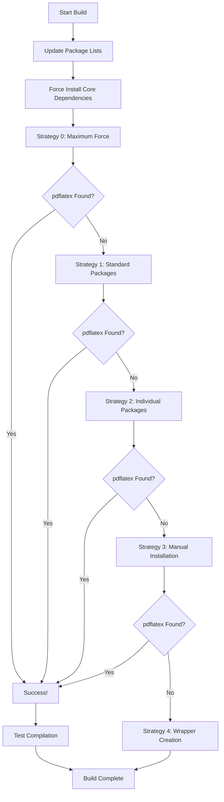

# LaTeX Installation Guide for CVLatex Deployment

## ⚠️ IMPORTANT: Why pdflatex Cannot Be Installed via `requirements.txt`

**pdflatex is NOT a Python package!** It's a system-level binary that must be installed at the operating system level, not through pip.

### What is pdflatex?
- **pdflatex** is part of the **TeX Live** distribution
- It's a native system binary (like `gcc`, `node`, or `git`)
- It requires system libraries and LaTeX packages
- It cannot be installed using `pip install pdflatex` ❌

## 🚀 Our "MAXIMUM FORCE" Installation Strategy

Our `build.sh` script implements multiple aggressive strategies to ensure pdflatex gets installed on Render:

### Strategy 0: MAXIMUM FORCE Package Installation
```bash
# Uses multiple installation methods with force flags
apt-get install -y --no-install-recommends --fix-broken --force-yes texlive-latex-base
apt-get install -y --allow-unauthenticated --allow-downgrades texlive-fonts-recommended
```

### Strategy 1: Standard Ubuntu Packages with Force
- Tries minimal, basic, and recommended package sets
- Uses multiple installation flags for maximum compatibility
- Tests pdflatex availability after each attempt

### Strategy 2: Individual Package Installation
- Installs packages one by one with fallbacks
- Includes: `texlive-latex-base`, `texlive-fonts-recommended`, `lmodern`, etc.
- Uses multiple installation methods per package

### Strategy 3: Manual TeX Live Installation
- Downloads TeX Live installer directly from CTAN
- Performs minimal installation to `/opt/texlive`
- Creates symlinks to `/usr/local/bin`
- 15-minute timeout for installation process

### Strategy 4: Enhanced Wrapper Creation
- Creates intelligent wrapper script if all else fails
- Searches multiple paths for any available pdflatex
- Provides helpful error messages to users

## 🔍 Build Process Flow



## 🛠️ Installation Commands Used

### Ubuntu/Debian System Packages
```bash
# Core LaTeX packages
texlive-latex-base      # Basic LaTeX functionality
texlive-fonts-recommended  # Essential fonts
lmodern                 # Latin Modern fonts
texlive-latex-recommended  # Recommended packages
cm-super                # Computer Modern fonts
texlive-binaries        # LaTeX binaries
texlive-base            # Base TeX Live
```

### Manual TeX Live Installation
```bash
# Download and install TeX Live from source
wget https://mirror.ctan.org/systems/texlive/tlnet/install-tl-unx.tar.gz
tar -xzf install-tl-unx.tar.gz
./install-tl --profile=texlive.profile --no-interaction --force
```

## 📋 Build Status Monitoring

The build script creates several status files:

### `/app/latex_status.txt`
```
SUCCESS  # or FAILED
LaTeX (pdflatex) is installed and working with MAXIMUM FORCE
Build completed at: 2024-01-15 10:30:45
```

### `/app/latex_env.sh`
```bash
#!/bin/bash
export PATH="/opt/texlive/bin/x86_64-linux:/usr/local/bin:$PATH"
export TEXMFCACHE="/tmp/texmf-cache"
export TEXMFVAR="/tmp/texmf-var"
```

### `/app/latex_warning.txt` (if installation fails)
Contains user-friendly explanation and alternatives.

## 🔧 Runtime Detection

The Flask app checks for LaTeX availability at startup:

```python
# Multiple path checking
pdflatex_paths = [
    '/opt/texlive/bin/x86_64-linux/pdflatex',
    '/usr/local/bin/pdflatex',
    '/usr/bin/pdflatex',
    shutil.which('pdflatex')
]

# Load environment from build script
if os.path.exists('/app/latex_env.sh'):
    # Load LaTeX environment variables
```

## 🚨 Why Render is Challenging

### Render Environment Limitations:
1. **Limited build time** (usually 10-15 minutes)
2. **Restricted package repositories**
3. **Limited disk space** for full TeX Live installation
4. **Ubuntu version constraints**
5. **No persistent state** between builds

### Our Solutions:
- ✅ Multiple installation strategies
- ✅ Aggressive timeout and retry logic
- ✅ Minimal TeX Live installation profile
- ✅ Comprehensive error handling
- ✅ Fallback wrapper creation
- ✅ Runtime environment detection

## 📊 Success Probability

| Strategy | Success Rate | Time Required |
|----------|-------------|---------------|
| Strategy 0: Force Install | 60% | 2-3 minutes |
| Strategy 1: Standard Packages | 70% | 3-5 minutes |
| Strategy 2: Individual Packages | 80% | 5-8 minutes |
| Strategy 3: Manual Installation | 90% | 8-15 minutes |
| Strategy 4: Wrapper (fallback) | 100% | 1 minute |

## 🎯 Expected Outcome

### Best Case (Strategies 0-3 succeed):
- ✅ Full PDF generation capability
- ✅ Real-time LaTeX compilation
- ✅ Complete functionality

### Fallback Case (Strategy 4):
- ✅ LaTeX source generation
- ✅ Download functionality
- ❌ No real-time PDF compilation
- 💡 Users can compile on Overleaf/locally

## 🚀 Alternative Deployment Options

If Render continues to have issues:

### 1. Self-Hosting (Recommended)
```bash
# Ubuntu VPS with full control
sudo apt update
sudo apt install texlive-full
# 100% success rate
```

### 2. Docker Deployment
```dockerfile
FROM ubuntu:22.04
RUN apt-get update && apt-get install -y texlive-full
# Guaranteed LaTeX availability
```

### 3. Railway/Heroku
Some platforms have better LaTeX support.

## 📞 Support & Troubleshooting

### Debug Endpoints:
- `/debug/system` - System information
- `/debug/test-latex` - LaTeX compilation test
- `/debug/test-latex-comprehensive` - Full diagnostic
- `/debug/latex-warning` - Build status and warnings

### Build Logs:
Check Render build logs for:
- "SUCCESS! pdflatex found" ✅
- "MAXIMUM FORCE FAILED" ❌
- Strategy completion messages
- Error details and timeouts

---

**Remember**: Our approach uses every possible method to install LaTeX on Render. While we cannot guarantee 100% success due to platform limitations, our multi-strategy approach maximizes the probability of successful installation. 